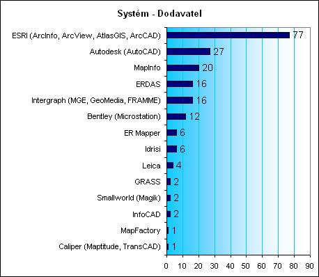
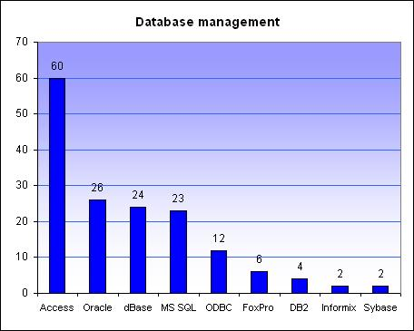
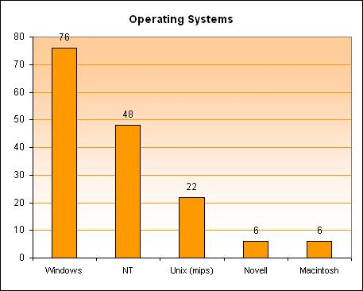
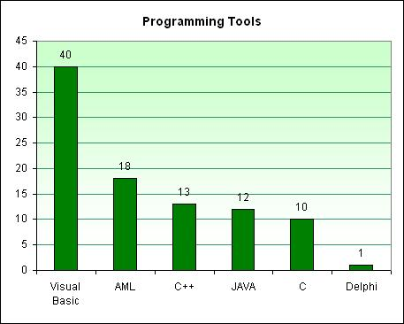

<!--
title : 30 tisíc odborníků GIS
author : Roman Ožana <ozana@omdesign.cz>
date : 18.11.2006 19:49:25
tags : GIS
-->

# 30 tisíc odborníků GIS

Narazil jsem na zajímavý průzkum, **mezi 30 tisíci Gisáky** z celého světa.

Praxe všech dotázaných je průměrně 4.81 let v oboru GIS a přidružených. Mezi dotazovanými bylo **78% mužů a 22% žen**.

Nejvíce dotázaných dosáhlo **bakalářského titulu** (40%). Titul MS (obdoba českého Ing.) pak vlastnilo 14% dotazovaných.

Ostatní údaje najdete na stránce [GISJobs][1] nebo se podívejte **na grafy níže.**

<!--more-->

  Data nejsou nijak normalizována ani upravena, vyjadřují preference jednotlivých účastníu průzkumu (celkový počet účastníku je 32486 osob).

  <strong>Preferovaný GIS systém a dodavatel</strong>

  

  <strong>Preferované databáze</strong>

  

  <strong>Preferované OS</strong>

  

**Preferovaný programovací jazyk**

  

 [1]: http://www.gisjobs.com/survey/responses.jsp?countryLoc=all "GISJobs - průzkum výsledky průzkumu"