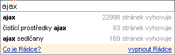

<!--
title : AJAX bude mít zítra rok
author : Roman Ožana <ozana@omdesign.cz>
date : 17.2.2006 19:55:10
tags : google, webdesign
-->

# AJAX bude mít zítra rok

Google Suggest</a> &#8211; našeptáva� od &#8211; byl asi první
  * [Seznam][3] &#8211; našeptáva� seznamu
  * [Centrum][4] &#8211; našeptáva� centra a nějaké další věci v nové verzi vyhledáva�e
  * [T-zones][5] &#8211; Posílání SMS a různé další

**A co je to ? To je bílá díra &#8230;** <strong :</strong> je zkratka _Asynchronous JavaScript and <abbr>XML</abbr>_. Samotná technologie **umí poslat požadavek** (nebo jen nějaké data) na server aniž by bylo nutné **obnovovat celou stránku** (Máte pocit jako by jste pracovali s běžnou aplikací na desktopu).

  

**Příklad našeptáva�e**

  1. Napíšete slovo do formuláře
  2. Javascript, který je **spuštěn ve vašem prohlíže�i** vás stále dokola hlídá
  3. **Na�te zadané slovo** aniž by jste jej museli odeslat (třeba kliknutím na tla�ítko)
  4. Vyšle **požadavek na server** &#8211; konktétními skriptu, funkce (PHP)
  5. Ten se napojí na databázi a **dotáže se na zadané slovo**
  6. Skript výsledek odešle zpět Javascriptu, ten zařídí, že se vám vylistuje **seznam nalezených slov**

**Chcete-li se dozvědět více**

  * [Root][6] &#8211; Článek na Root
  * [PHP Triky][7] &#8211; Taky �lánek o AJAXu
  * [Snížekweb][8] &#8211; kde jsou hranice AJAXu
  * AJAX Matters &#8211; všecko možné o AJAXu &#8211; ukázkové aplikace
  * [AJAX magazín][9] &#8211; magazín věnující se výhradně této technologii<p

 [1]: http://ajax.phpmagazine.net/2006/02/happy_birthday_ajax.html "Narozeniny AJAXU"
 [2]: http://beta.mapy.cz "Beta Mapy Seznam"
 [3]: http://www.seznam.cz "Seznam - super Vyhledáva�"
 [4]: http://www.centrum.cz "Centrum - Super vyhledáva�"
 [5]: http://t-zones.cz/ "T-Mobile zóna pro zákazníky"
 [6]: http://www.root.cz/clanky/ajax/?SID=54F82AE4E7E493D25C7F0AF375DC2F5B "AJAX"
 [7]: http://php.vrana.cz/ajax.php "Technologie AJAX"
 [8]: http://www.snizekweb.cz/clanky/ajax-kde-jsou-hranice/
 [9]: http://ajax.phpmagazine.net/