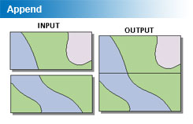

<!--
title : Append není Merge
author : Roman Ožana <ozana@omdesign.cz>
date : 28.10.2006 21:36:39
tags : ESRI, how-to
-->

# Append není Merge

Mezi funkcemi **Append a Merge** je trošičku rozdíl ([Merging not Appending][1]). Funkce merge na chvilku zmizela, ve **ArcGIS 9.0** ji nenajdete, v pozdějších verzích se opět vrátila.

Plnohodnotnou náhradu funkce merge pro **ArcGIS 9.0** si můžete stáhnout v podobě [TBX souboru ze stránek ESRI][2]. No a na závěr jaký je ten rozdíl mezi Append a Merge.

**Append** &#8211; přidá do existující vrstvy další vrstvu a propojí navazující prvky (obrázek níže)

  

**Merge** &#8211; prostě jen sloučí vrstvy do jiné nové vrstvy

  

 [1]: http://forums.esri.com/Thread.asp?c=93&f=983&t=129867#375525-Diskuzn%C3%ADvl%C3%A1knoMerging "Merging not Appending"
 [2]: http://forums.esri.com/Attachments/10398.tbx "TBX Soubor do ArcToolboxu - Fce Merge"