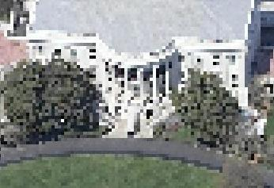
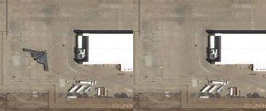

<!--
title : Bezpečné mapy především
author : Roman Ožana <ozana@omdesign.cz>
date : 14.10.2006 21:43:50
tags : GIS
-->

# Bezpečné mapy především

Na to, abych zjistil přesnou polohu [Bíleho domu][1] dneska stačí **několik kliknutí v mapě**. To samé platí o jaderné [elektrárně Dukovany][2] a mnoho **mnoha dalších objektech**, dřívě úzkostlivě střežených.

Zástupce společnosti Google prohlásil, že rozlišení, které by mohlo znamenat **skutečné** **bezpečnostní** **riziko** bude dostupné zhruba **kolem roku 2015**. Dalo by se tedy říct, tak to máme ještě **pár let čas**.

Některé &#8220;kosmetické&#8221; změny můžeme pozorovat už dnes. Tak například společnost Microsoft cíleně **rozmazává (blur) některé citlivé oblasti.** Takto postižené jsou data v [okolí Bílého Domu][3].

  

Hodně se operuje také s tím, že **data jsou neaktuální**. Ale jak jsem nedávno četl, chce společnost [Astrovision Australia][4] zpřístupnit přes internet **v roce 2008 real-time data**.

Prostě **bezpečně se dožijeme** doby, kdy už nebude tak **bezpečno**. A pak se může stát, že některé věci na **snímcích prostě zmizí**. Popřípadě budou snímky jinak upraveny, aby neznamenali bezpečnostní riziko.

  

 [1]: http://maps.google.com/maps?f=q&hl=en&sll=37.0625,-95.677068&sspn=48.688845,82.441406&ie=UTF8&z=19&ll=38.897648,-77.036484&spn=0.001472,0.002516&t=k&om=1&iwloc=A "Kdepak že to žije ten prezident USA"
 [2]: http://www.mapy.cz/?mapType=ophoto&zoom=16&centerX=137059726&centerY=132408593&portWidth=938&portHeight=733&forceMapParams=1&query=49%C2%B05'13.76%22N,16%C2%B08'18.1%22E&page=1&searchPort=137054272_132391632_137084288_132418368 "Kdepak že je to ta alektrárna"
 [3]: http://local.live.com/default.aspx?v=2&cp=38.897932~-77.036841&style=o&lvl=2&scene=175055 "Live Local Bird's View"
 [4]: http://www.astrovisionaustralia.com/ "Odkaz na stránky společnosti Astrovision Australia"