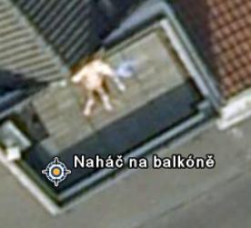
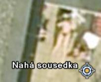

<!--
title : Co dělá vaše sousedka ?
author : Roman Ožana <ozana@omdesign.cz>
date : 27.9.2006 06:42:36
tags : GIS, google, zajimavosti
-->

# Co dělá vaše sousedka ?

Nebo co dělá Váš soused? Myslím, že neexistuje nikdo, kdo by se alespoň jednou za život takhle nezeptal. Dneska dostanete odpoveď od někoho, od koho by jste to opravdu nečekali. Ten někdo se jmenuje [Google Earth][1].

To máte tak, když ono snímkování je možné provádět pouze v **dobrém počasí**. No a když už je to dobré počasí, většinou svítí sluníčko. To se pak sousedé a sousedky opalují nejen nahoře bez :-).

Nesporně však rostoucí rozlišení dat dostupných přes Google Earth znamená čím dál tím větší zásah do Vašeho soukromí. Tyhle kuriozitky se podařili najít [Komunitě Google Earth][2] v Nizozemí.

  

 [1]: http://www.google.com/earth/ "Odkaz na stažení programu Google Earth"
 [2]: http://bbs.keyhole.com/ "Odkay na stránky komunity Google Earth"