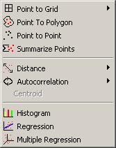
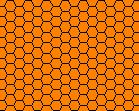

<!--
title : DIVA GIS – Free software
author : Roman Ožana <ozana@omdesign.cz>
date : 24.6.2006 22:51:33
tags : GIS, software
-->

# DIVA GIS – Free software

Tak jsem po dlouhé době zase testnul nějaký **free GIS software** (pro windows). Dneska se to jmenuje [DIVA GIS 5.2][1].

Hned po instalaci jsem si docela oddechl, že se jedná o uživatelsky příjemný program (žádné šílenosti ala menu [TNT mips][2]). K programu si můžete [stáhnout ukázkové data][3].

DIVA GIS **choval stabilně**, prostě se mi jej nepodařilo zhodit (až na nějaké ty chybové hlášky &#8211; to bylo způsobeno uživatelem :)).

Dělal experimenty například s **generováním** **šílené** šesti-úhelníkové sítě (ten oranžový obrázek vlevo) program pracoval docela svižně i s tímto. Při generování pravda jevil známky usilovné práce.

Mimochodem mě při tom napadlo, že možná bylo dobré vytvořit nějaké jednotné **testovací data**, pro testovaní rychlosti GIS software.

Funkce programu jsou v podstatě standardní (zoom, pan, add layer a podobně), zajímavě vypadají **menu Analysis** (obrázek vpravo nahoře), Modeling a Grid. Pokud si chcete přečíst více o tom, co program umí doporučuji se [podívat se do manuálu][4].

 [1]: http://www.diva-gis.org/ "Odkaz na stránky DIVA GIS"
 [2]: http://www.microimages.com/ "Odkaz na formu tvořící program TNT Mips"
 [3]: http://www.diva-gis.org "Data k software - DIVA GIS"
 [4]: http://www.diva-gis.org/ "Manuály ke stažení - DIVA GIS"