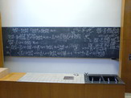

<!--
title : Expertní systémy
author : Roman Ožana <ozana@omdesign.cz>
date : 16.4.2006 18:44:56
tags : mix, student
-->

# Expertní systémy

> Ehh, plus 20 % kursu mínus Pythagorova věta, to znamená … násobeno dvěma, děleno osou X mínus jedna rovná se celková rychlost Červeného trpaslíka, což znamená, že vím všechno o vesmírném inženýrství.

Aneb jak vysvětlit rekurentní neuronové sítě na několik mnoho popsaných tabulí :-) zcela jasně.

    Foto : Peťa

