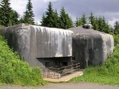

<!--
title : Fandové technických památek a GPS
author : Roman Ožana <ozana@omdesign.cz>
date : 9.2.2006 20:51:22
tags : GIS, GPS
-->

# Fandové technických památek a GPS

Náhodou jsem narazil na zajímavou stránku a sice [http://www.technickepamatky.com][1], pokud jste fandové technických památek jistě vás tahle stránka úplně nadchne.

Na stránkách najdete **GPS pozice většiny objektů** &#8211; takže až někdy půjdete na **GISáckou výpravu** stačí si udělat **předběžný průzkum** :-) oblasti. Bohužel o Ostravě tam moc dat není, tak by to možná chtělo podniknout nějakou mapovací výpravu. K objektům je **pořízená fotodokumentace**, k některým jsou pořízené tzv. anaglyphy. [Anaglyphy][2] jsou takové ty červeno zelené **3D obrázky**, na stránkách je rovněž [odkaz na software][3] pomoci nějž je možné tyto obrázky vytvářet.

 [1]: http://www.technickepamatky.com/
 [2]: http://images.google.com/images?q=anaglyph "Odkaz na Google"
 [3]: http://anabuilder.free.fr/ "Vytvořte si vlastná anaglyph pomocí AnaBuilderu"