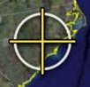

<!--
title : Fotky umístěné v souřadnicích
author : Roman Ožana <ozana@omdesign.cz>
date : 5.10.2006 21:30:27
tags : GIS, google, GPS
-->

# Fotky umístěné v souřadnicích

Rozhodl jsem se napsat takový **návod** na to, jakým způsobem **umístit fotografie do souřadnic** v [Google Earth][1] s využitím [Google Picasa][2].

Takže koho tahle problematiky zajíma, tak jako mně, podívejte se na [download id=&#8221;9&#8243;]. A pak taky bonusek, jednu umístěnou fotografii do souřadnic, co bych pracovně nazval [Na gisáckém výletě][3] :).

 [1]: http://earth.google.com/ "Google Earth"
 [2]: http://picasa.google.com/ "Google Picasa"
 [3]: ostravice.kmz