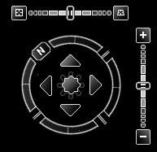

<!--
title : Google Earth v novém
author : Roman Ožana <ozana@omdesign.cz>
date : 14.6.2006 12:53:22
tags : GIS, google
-->

# Google Earth v novém

Nová verze Google Earth 4.0 Beta je na světě a tentokrát bylo pamatováno i na uživatele OS Linux. [Takže stahujte][1], instalujte, testujte a cestujte. A teď neco k samotné aplikaci, jen tak na **první pohled**:

  * Ovládání je takové více hvězdné (fakt super severka &#8211; ukázka je na obrázku dole)
  * Zmizel dolní panel (co s ním jiného)
  * Byly přidány nové nástroje (Add Polygon, Add Point&#8230;)
  * Je možné vypnout boční panel (jako v kině :-))
  * Celkově se mi aplikace líbí (vzhledem)

  

Jsem zvědav, jakou odpověď si připraví ESRI se svým [ArcGIS Explorerem][2] ? Co nabídne zajímavějšího (pro gisáky)?

 [1]: http://earth.google.com/download-earth.html "Stažení Google Earth 4.0"
 [2]: http://www.esri.com/software/arcgis/explorer/index.html "Stránky o produktu ArcGIS explorer"