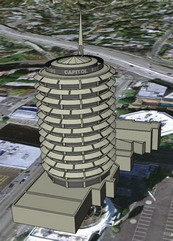

<!--
title : Google uvolnil SketchUp zdarma
author : Roman Ožana <ozana@omdesign.cz>
date : 28.4.2006 11:33:14
tags : GIS, google, software
-->

# Google uvolnil SketchUp zdarma

Nedávno [Google][1] koupil firmu **@Last Software** vydávající program [SketchUp][2].

Je to software pro snadné a jednoduché kreslení ve 3D, dneska tento software uvolnil google zdarma ke stažení zde <a href="http://sketchup.google.com/" target="_blank">Google SketchUp</a>.

Jen je opravdu velká škoda, že vývojáři u verze SketchUp FREE nepodpořili klasický GIS a jeho uživatele. Co do exportu jsou podporovány jen rastové soubory a KMZ (ten by snad měl umět nový ArcGIS). Momentálně nezbude než si koupit licenci na verzi SketchUp Professional :-(.

 [1]: http://www.google.com/ "Google :-)"
 [2]: http://www.sketchup.com/ "Stránky SketchUP"