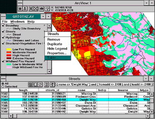

<!--
title : Instalace ArcView 1.0
author : Roman Ožana <ozana@omdesign.cz>
date : 25.7.2006 07:01:47
tags : ESRI, GIS
-->

# Instalace ArcView 1.0

Píše se rok 1993, právě jste si v koupili jako řádný americký občan instalční CD-ROM s velmi populárním programem **ArcView 1.0**. ArcView bylo sice vydáno již v roce 1992, ale víte jak to chodí. Usedáte ke svému PC.

První co se ptáte. Jaké jsou systémové požadavky ? Pojede mi to vůbec?

  * Windows 3.0, 3.1 a 3.11 (jako nádstavbu operačního systému DOS)
  * Procesor minimálně **80386 PC** nejlépe s matematickým co-procesorem (popřípadě je možné použít jeho emulátor)
  * 15 megabajtů volné **diskové kapacity** a 8 megabajtů **operační paměti**

ArcView 1.0 je opatřen samoinstalačním programem, který by měl dokázat vše zprovoznit bezproblémově. Spouštíte tedy v příkazové řádce DOS **install.exe**. Po dokončení instalace, nedočkavě čekáte než se spustí **grafickou nádstavbu operačního systému** windows. A hle povedlo se :-)

  

Poklikáte na ikonu a takhle nějak to vypadá:

  

