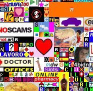

<!--
title : Jak vydělat milion dolarů
author : Roman Ožana <ozana@omdesign.cz>
date : 27.12.2006 14:24:39
tags : webdesign
-->

# Jak vydělat milion dolarů

Jistě jste něco slyšeli o úspěchu stránky [MilionDollarHomePage][1]. Tuhle stránku vytvořil **Alex Tew**, původně mu měla stránka **vydělat na jeho studia**, ale trošičku se to zvrhlo a vydělala mu jeho **první milion** (dolarů).

Dneska přichází Alex opět s něčím co zase o kousek posouvá hranice! A sice projekt <http://www.pixelotto.com/>.

Koncept je velmi podobný, opět **prodává jednotlivé pixely** pole 1000 x 1000, ale tentokrát za 2 dolary.

Teď to nejlepší, první vydělaný milion si nechá Alex a druhý poputuje **do loterie** a můžete jej vyhrát i vy. Podmínka zařazení do soutěže je **kliknutí na nějakou reklamu**. Tomu říkám skvělý marketingový tah!

 [1]: http://www.milliondollarhomepage.com/ "Odkaz na stránku co vidělal milion dolarů prodejem pixelů"