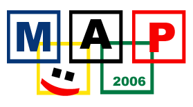

<!--
title : Map Games
author : Roman Ožana <ozana@omdesign.cz>
date : 14.2.2006 18:55:28
tags : student
-->

# Map Games

Kamarádka Lenka mě upozornila na [výbornou hru ve flash][1] (celou skupinu her), u kterých si procvičíte zeměpis a současně si krásně pocvičíte v anglická slovíčka. Takže všichni povinně vyzkoušet, naučit !!!

  

Rozhodli jsme se totiž uspořádat první **MapGame Olympiádu v Ostravě** &#8211; pod bedlivým dohledem Mgr. Ivany Češkové (bude-li souhlasit). Skvělé ceny jsou zaručeny (pokud nějaké zajistíme &#8211; jinak musí stačit obdiv ostatních :-)).

 [1]: http://www.sheppardsoftware.com/web_games_menu.htm#Geography "Odkaz na MapGames"