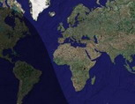

<!--
title : Mapa osvětlení Země
author : Roman Ožana <ozana@omdesign.cz>
date : 19.5.2006 07:05:41
tags : GIS, google
-->

# Mapa osvětlení Země

Server <http://www.daylightmap.com/> publikoval zajímavou mapu osvětlení povrchu Země sluncem. Jako mapový podklad použili mapy Google.

V pravé části mapy je dosti nezřetelné **žluté Options**. V tomto options si můžete zvolit jakýkoliv datum a čas. Na počátku je nastaveno přirozeně datum aktuální.