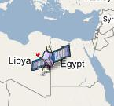

<!--
title : Mapa polohy družic nad povrchem
author : Roman Ožana <ozana@omdesign.cz>
date : 22.5.2006 10:01:53
tags : GIS, google
-->

# Mapa polohy družic nad povrchem

Další aplikace využívající mapové podklady Google je opět velmi zajímavá. Stačí si vybrat družici ze slušného seznamu zahrnující například takové vesmírné stálice jako Hubble, ISS nebo Meteosat a server [www.n2yo.com][1] vám ukáže, kde se tahle družice nachází.

Vedle mapy se taky zobrazí základní informace o poloze a oběžné dráze. Poloha družice je přepočítávána v reálném čase, takže můžete pozorovat kam má družice namířeno.

 [1]: http://www.n2yo.com