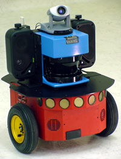

<!--
title : Mapovací robotek
author : Roman Ožana <ozana@omdesign.cz>
date : 4.5.2006 06:37:54
tags : hardware
-->

# Mapovací robotek

Seznamte se tohle je **Sarah**, robotek určený k mapování místností a tvorbě plánů budov. Je vybaven laserovým měřičem vzdáleností, kamerovým systémem a HDD.

Primárně je určen pro sběr dat pod střechou. Tohle je spíše taková hračka, jeho kolegové však mohou zachraňovat lidské životy, když sbírají data v místech nebezpečných člověku (bomby, sutiny, hospody&#8230;).

Původní článek : [Robot Mapper][1]

 [1]: http://www.allpointsblog.com/archives/1411-Robot-Mapper.html "Mapující robotek"