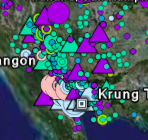

<!--
title : Mapování ptačí chřipky
author : Roman Ožana <ozana@omdesign.cz>
date : 28.3.2006 14:58:39
tags : GIS, google
-->

# Mapování ptačí chřipky

Momentálně asi největšímu strašáku dneška se podařilo proniknout i do sféry GISu, a tak jestli si chcete prohlídnout mapu ([přímí odkaz na mapu][1]) &#8220;**pokrytí Zěmě**&#8221; ptačí chřipkou v aplikaci Google Earth [pokračujte na tento web][2]. Vypadá to hodně nepovzbudivě ! Na obrázku je jen malá ukázka nejpostiženějších oblastí, kdesi na dálném východě ([klikni pro větší ukázku][3]).

 [1]: http://www.declanbutler.info/Flumaps1/top_parent_network_link.kml "KML Soubor - Mapa ptačí chřipky"
 [2]: http://declanbutler.info/Flumaps1/avianflu.html "Mapování ptačí chřipky"
 [3]: chvelkamapa.jpg "Velká ukázka mapy"