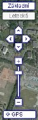
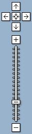

<!--
title : Najdete to v mapě – beta.mapy
author : Roman Ožana <ozana@omdesign.cz>
date : 6.2.2006 14:33:08
tags : GIS
-->

# Najdete to v mapě – beta.mapy

No jo, ale **kde najdu tu mapu**. Na internetu je docela hodně různých zajmavých map &#8211; mapových serverů, tady je malý seznam těch, které se můžou někdy hodit.

  * Škoda Router Planner &#8211; naplánování cesty ČR a Evropa, výborné pokud jedete na dovolenou
  * [GlobalSearch][1] &#8211; Autotrasy po EvropÄ› a ÄŒR
  * vychází z [Maporama][2]
  * [WorldLive][3] &#8211; webkamery světa umístěny v mapě
  * [MapLandia][4] &#8211; zase využívají Google Maps, ale vcelku zajmavě strukturováno podle států

Na závěr bych uvedl [http://beta.mapy.cz][5] od [Seznamu][6], které vypadají **jako kdyby je dělal Google.** Ale to vůbec neva, když to ovládání je tak super jasné a jednoduché. Na ukázku vlevo ovládání **Seznamu** vpravo ovládání **Google** (nebo to bylo naopak :-)).

   

Časem to zřejmě nahradí momentální [mapy od seznamu][7]. Betaverze obsahuje **vyhledáva� trasy, najdi nejbližší, dopravní informace**. Po zprovoznění se myslím máme na co těšit &#8211; hlavně se mi líbí letecké snímky celé ČR a tak přikládám jak jinak než **ukázka areálu VŠB**.

  

  Super je taky <strong>funkce GPS</strong> &#8211; pomoci níž je možné ur�it souřadnice místa na mapě. Samozdřejmě si do mapy můžete umístit <strong>vlastní ikonu</strong> (bohužel mi u toho spadl prohlíže� FF 1.5.0.1).

 [1]: http://www.globalsearch.cz/autotrasy.asp "Autotrasy po EvropÄ›"
 [2]: http://www.maporama.com/share/ "Vyhledávání adres po celé evropě"
 [3]: http://www.worldlive.cz/mapy "Webkamery a různé mapy"
 [4]: http://www.maplandia.cz/ "Maplandia mapy podle zamí a kontinentů"
 [5]: http://beta.mapy.cz/
 [6]: http://www.seznam.cz/ "Portál Seznam"
 [7]: http://www.mapy.cz/ "Mapy portálu seznam"