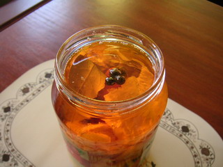
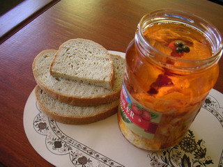

<!--
title : Nakládaný hermelín
author : Roman Ožana <ozana@omdesign.cz>
date : 25.11.2006 11:44:46
tags : mix, Recepty, student
-->

# Nakládaný hermelín

Jsou to právě 4 dny co jsme si doma **naložili hermelínek**. Posuďte sami nevypadá to úplně božsky?

  

**Co budete potřebovat?**

  * Několik sklenic tzv. **sedmiček** (nebo 5 litrovou velkou sklenici od okurek)
  * (Sedlčanské) **hermelíny** &#8211; dle počtu osob, čím více tím lépe
  * Kvalitní rostlinný Olej, nejlépe slunečnicový tak asi litr až dva podle množství herrmelínů
  * Několik cibulí a česnek
  * Nakládané feferonky (nebo chilli papričky)
  * Koření: sladkou červenou papriku, bobkový list, kuličky nové koření, pepř kuličkový

**Jak na věc?**

  * Oloupejte a na proužky nakrájejte **cibuli**.
  * Oloupejte si česnek a připravte feferony.
  * Rozkrojte **podélně hermelín** (na dvě kolečka).

**Jdeme plnit do sklenic**

  * Obě poloviny hermelínu jemně **posypejte červenou paprikou**.
  * Do sklenic pokládejte vždy nejprve hermelín, pak cibuli a (lisovaný) česnek a vše zakapejte olejem.
  * **Feferonky**, jak kdo snese. Ideální dvě až tři na láhev.
  * Nahoru dle chuti přidávejte koření (cca 10 kuliček **pepře**, 5 kuliček **nového koření** a 3 **bobkové listy** na sedmičku).
  * Až bude sklenice plná, stačí ji **dolít olejem** (tak 1 cm od vrchu nechtě volný).
  * Sklenici **uzavřete zlehka** víčkem.

**Čekání a hlavně konzumace!**

  * Zrání může při pokojové teplotě trvat **tak 7-14 dní**. Záleží na tom, jak ho máte rádi.
  * Hlavně ho nemějte na sluníčku a občas doporučuji povolit a zkontrolovat (neujídat).
  * Podávat s Pivem, čerstvým chlebem a hlavně vychutnávat !

  

