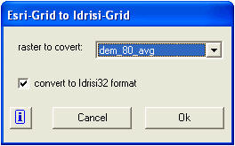

<!--
title : Převod ESRIGrid do IDRISI
author : Roman Ožana <ozana@omdesign.cz>
date : 16.4.2006 10:46:30
tags : ESRI, GIS, software
-->

# Převod ESRIGrid do IDRISI

Není snažší způsob jak převést ESRI gridu do formátu IDRISI, než využít rozšíření ArcGIS9.x. Rozšíření je zdarma ke stažení na stránce [Grid2Idrisi 1.0 für ArcGIS][1].

Rozšíření rozbalte do ArcGIS/BIN, pak postupujte podle návodu, který se dá stáhnout na stránkach rozšíření. Při testování jsem narazil na několik rastrů, které převést nešly &#8211; bohužel ty jsem potřeboval právě nejvíc :-( holt zákon schválnosti.

 [1]: http://www.terracs.de/ArcGIS_9_x/Grid2Idrisi/grid2idrisi.html "Grid2Idrisi 1.0 pro ArcGIS"