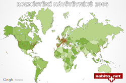

<!--
title : První narozeniny
author : Roman Ožana <ozana@omdesign.cz>
date : 29.9.2006 19:18:00
tags : nezarazeno
-->

# První narozeniny

Dneska mají stránky [www.nabito.net][1] přesně jeden rok. Za tu dobu jsem stihl napsat zhruba **sto článků** a přivítat 25 tisíc návštěvníků. Všem příznivcům těchto stránek bych chtěl poděkovat.

No a myslím, že by to nebyly pořádné GISácké narozeniny bez mapy :-). Koukněte z jakých koutů [světa jsou naši návštěvnící][2].

  

 [1]: http://www.nabito.net
 [2]: mapa2006.jpg "Mapa rozmístění návštěvníků v roce 2006"