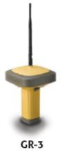

<!--
title : Seznamte se – přijímač GR-3
author : Roman Ožana <ozana@omdesign.cz>
date : 16.10.2006 07:24:34
tags : GPS, hardware
-->

# Seznamte se – přijímač GR-3

Jedná se o GPS **přijímač firmy [TopCon][1]**, který je jako **první na světě** schopný zpracovat signál ze všech družicových navigačních systému. To tři G znamená pochopitelně **GPS, Glonass, Galileo** :-).

Co máme pod kapotou ?

  * Dvě Li-ION baterie, které jse možné **vyměnit za chodu** (nedojde k přerušení práce)
  * Záložní baterie je možno **doplnit 4 kusy AA baterii**
  * Veškeré spojení je bezdrátové &#8211; **Bluetooth** (Technologie Cable-Free)
  * Přijímač je možné vybavit na přání slotem **pro SIM kartou** (příjem korekcí) &#8211; bohužel zatím **ne pro evropské sítě**
  * Naměřené data je možné **ukládat na SD kartu** (slot také přímo v přijámači) &#8211; pod baterii
  * Vodě odolný design
  * **72 kanálů** pro příjem signálu (až 36 družic)
  * Operační čas přijímače **až 12 hodin**
  * [ostatní zde][2]

 [1]: http://www.topconpositioning.com/ "Stránky TopCon Positioning System (TPS)"
 [2]: http://www.topconpositioning.com/ "Všechny informace o přijímači GR-3"