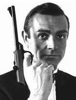

<!--
title : Stav školství v ČR
author : Roman Ožana <ozana@omdesign.cz>
date : 27.2.2006 10:52:09
tags : student
-->

# Stav školství v ČR

Američani pošlou **špičkovýho tajného agenta** do čech, aby **zjistili stav českýho vysokýho školství**.

Vyšlou tedy prvního z nich. Agent jde na prednášky, ale hned první den je odhalen, tak se musí vrátit zpet do Ameriky.  
Tam se ho ptají : &#8220;_Co tady deláš? Jak to, že te odhalili?_&#8220;  
A on říká : &#8220;_No, byl jsem na přednášce, všichni tam spali, jen já jsem dával pozor&#8230;_&#8220;

Američani tedy vyšlou **druhého špičkového agenta**, který je již náležite poučen. Ten se do Ameriky vrátí po týdnu.  
Oni se diví : &#8220;_Jak to,že se vrátil tak brzo, i když byl poučený._&#8220;  
On říká : &#8220;_No, byl jsem na prednášce, všichni tam spali, spal jsem taky. Pak se šlo do hospody, všichni hulili a chlastali, jen já ne, a tak me odhalili&#8230;_&#8220;

Američani tedy vyšlou **třetího špickovýho agenta**, který je také náležitě poučen. Ten se vrátí po půl roce.  
Američani se diví : &#8220;_Jak to že ses vrátil, kdyžs tam vydržel tak dlouho?_&#8220;  
A on říká : &#8220;_No, šel jsem na prednášku, všichni tam spali, spal jsem taky. Pak se šlo do hospody, všichni hulili a chlastali, hulil jsem a chlastal taky, no pak přišlo zkouškový, všichni to udelali a mě vyhodili._&#8220;

Poslal : Martin Prager