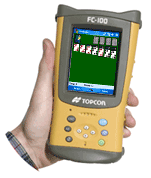

<!--
title : TopCon aktualizoval SW
author : Roman Ožana <ozana@omdesign.cz>
date : 21.7.2006 20:37:04
tags : GIS, GPS
-->

# TopCon aktualizoval SW

Ano tak je to zde zase, [TopCon][1] opět aktualizoval své SW používané pro získávání prostorových dat pomocí GPS. Aktuálně verze je nyní **TopSURV 6.04**.

Za poslední rok je to třetí aktualizace, což zřejmě svědčí o **kvalitě SW,** nebo o tom, že vývojáři mají hlavy **stále plné nových nápadů** :-).

Nejsem zde však od toho, abych někoho soudil stačí mi, když to bude fungovat lépe než předešlá verze a nebude to padat při importu dat ze zařízení (kontroleru).

 [1]: http://www.topconpositioning.com/ "TopCon - GPS sekce"