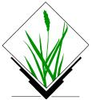
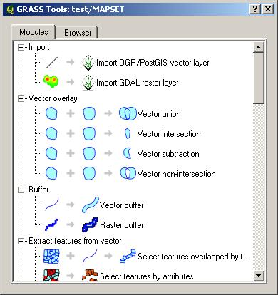

<!--
title : Tráva se zelená
author : Roman Ožana <ozana@omdesign.cz>
date : 11.8.2006 19:39:58
tags : GIS, software
-->

# Tráva se zelená

Dneska vyšla nová verze **GRASS 6.1.0**. Tato verze je opatřena nově grafickým GIS manažerem (Quantum GIS) a rovněž je vylepšena navigace v menu. Na to menu jsem opravdu zvědav, jelikož v tom minulém, aby se čert vyznal :-). Tato verze je ke stažení na stránkách [GRASS GIS][1]. Platforem je podporována celá řada [včetně windows][2].

Přečtete si [všechny vylepšení][3] a novinky, které jsou v tomto GRASSu.

GRASS je ve verzi, kterou jsem zkusil, koncipován jako zásuvný modul do Quantum GIS. Prostředí s Vámi komunikuje převážně v češtině. Navíc se snaží **podávat nápovědu** k tomu co právě děláte (zakládání mapsetu je dnes hračkou). Na následujícím obrázku je ukázán Grass Toolset. Myslím, že jste hned poznali co k čemu je.

  

  Po vyzkoušení musím uznat, že GRASS urazil opravdu kus cesty směrem k běžnému uživateli, který rád objevuje funkce programu <strong>pomoci kurzoru myši</strong>. Uvidíme jestli je ta tráva nakonec opravdu tak zelená jak se zdá.

 [1]: http://grass.itc.it/download/index.php "GRASS GIS Download"
 [2]: http://download.qgis.org/qgis/ "Ke stažení zde"
 [3]: http://grass.itc.it/announces/announce_grass610.html "Novinky a vylepšení"