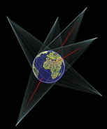
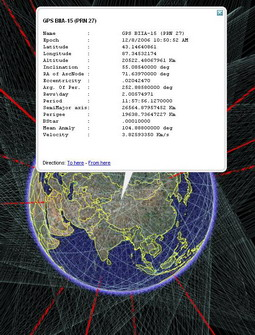

<!--
title : Vizualizace GPS družic v GE
author : Roman Ožana <ozana@omdesign.cz>
date : 21.12.2006 23:34:56
tags : google, GPS
-->

# Vizualizace GPS družic v GE

[][1]Jsem **naprosto uchvácen**, touhle vizualizací polohy [GPS družic][2] v Google Earth. Nezbude než moc **poděkovat** [uživateli KeyHole][3] nickem **Pseabury**, který má tohle všechno na svědomí. Obrázek vpravo ukazuje několik družic v prostoru nad Zemí.

Moc **pěkně to vypadá**, pokud zapnete úplně všechny :-) jako kdyby se Země zahalila do závoje.

Předešlý obrázek ukazuje výpis informací o konkrétní **GPS družici**. **Pseabury** se nesoustředil jen na **GPS satelity**, ale vizualizuje polohu celé řady dalších [známých i neznámých satelitů][4].

  

 [1]: gps-in-ge1.jpg "Vizualizace několika GPS družic nad Zemí"
 [2]: http://bbs.keyhole.com/ubb/download.php?Number=644309 "Odkaz na KMZ soubor - Vizualizace GPS satelitů v Google Earth"
 [3]: http://bbs.keyhole.com/ "Odkaz na komunitu KeyHole"
 [4]: http://bbs.keyhole.com/ubb/showthreaded.php/Cat/0/Number/718137/page/0/vc/1 "Odkaz na celé vlákno diskuze s celou řadou vizualizačních souborů"