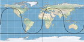

<!--
title : Výpočet polohy GPS satelitu
author : Roman Ožana <ozana@omdesign.cz>
date : 7.4.2006 06:41:11
tags : GIS, GPS, programovani
-->

# Výpočet polohy GPS satelitu

Tak jsem po docela dlouhé době dovedl do finále **výpočet polohy** GPS satelitu na základě údajů v navigační zprávě RINEX ([podívejte se na mapku][1]).Funkční verzi v PHP [dávám ke stažení zde][2], na první pohled to vypadá že už to počítá to co to počítat má.

 [1]: gps-sat-map.jpg "Ukázková mapka polohy satelitu 15"
 [2]: http://www.phpclasses.org/browse/file/13367.html