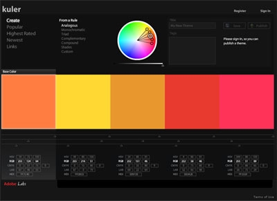

<!--
title : Webová barevná paleta
author : Roman Ožana <ozana@omdesign.cz>
date : 24.11.2006 15:30:42
tags : webdesign
-->

# Webová barevná paleta

Někdy člověk prostě míchá barvy a pořád se nemůže trefit té správné **barevné kombinace**. Pokud se dostanete do tohto stavu doporučuji navštívit stránky [Kuler][1] od firmy Adobe.

Stránky jsou určené ke sdílení webových barevných schémat, momentálně obsahují něco kolem 1200 schémat. V rámci stránek si můžete **vlastní barevné schémata** pohodlně namíchat, uložit, stáhnout nebo si je třebas nechat ohodnotit.

  

 [1]: http://kuler.adobe.com/ "Barevné palety snadno a rychle"