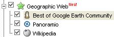

<!--
title : Wikipedia už i v Google Earth
author : Roman Ožana <ozana@omdesign.cz>
date : 10.12.2006 10:08:45
tags : GIS, google
-->

# Wikipedia už i v Google Earth

Včera Google přidal nové vrstvy do Google Earth. Jedná se celkem o **tři geografické vrstvy.** Vrstvy nemusíte nikde hledat, přidají se samy do Google Earth. Stačí pouze přiblížit se na oblíbené místečko. A můžete zde najít následující informace:

  * [Panoramio][1] &#8211; zajmavé fotky z celého světa
  * [Wikipedia][2] &#8211; informace z otevřené encyklopedie
  * [Google Earth Community][3] &#8211; to nejlepší z Keyhole

 [1]: http://www.panoramio.com/ "Panoramio - nejen panoramatické fotky z celého světa"
 [2]: http://en.wikipedia.org/wiki/Main_Page "Wikipedia"
 [3]: http://bbs.keyhole.com/ "Keyhole - Google Earth komunita"