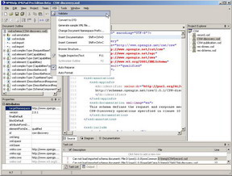

<!--
title : XMLPad editor XML
author : Roman Ožana <ozana@omdesign.cz>
date : 15.10.2006 12:08:12
tags : software
-->

# XMLPad editor XML

XMLPad je **skutečně** **pěkný editor** XML pro operační systém windows. Můžete jej stáhnout na [stránkách WmHelp][1]. Ovládání je velice intuitivní a kdo někdy viděl Visaul Studio nebude mít žádný problím s používáním tohoto programu.

  

Přednastaveny jsou šablony například pro RSS2, WSDL, XSL atd. Samozdřejmostí je **integrovaný validátor** kódu, **doplňování kódu**, automatické **formátování textu**.

 [1]: http://www.wmhelp.com/download.htm "Stažení editoru XMLPad"