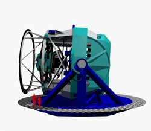

<!--
title : Google dobývá vesmír teleskopem
author : Roman Ožana <ozana@omdesign.cz>
date : 7.1.2007 22:08:44
tags : google
-->

# Google dobývá vesmír teleskopem

Země je nám už malá! Co naplat **musíme do vesmíru**. Tak přesně tohle si řekli v Google.

Dohromady se **spojilo 19 organizací** a plánují vybudovat [velký teleskop][1]. Data, která bude tento teleskop pořizovat budou **přenášeny online**.

Pro nás běžné uživatele to znamená jediné, konečně budeme mít možnost **podívat se do vesmíru**. Konečně si prohlídneme mlhoviny, hvězdokupy a podobné věci, které pro většinu znás zatím vypadají jako smetí na obloze.

Tohohle pohledu bychom se měli dočkat někdy **kolem roku 2013**. Každou noc by mělo být generováno něco kolem **30 terabajtů dat**. Takové množství dat by mělo být zpracováváno kontinuálně &#8211; takže bychom se mohli dostat k celkem aktuálním záběrům hvězdné oblohy. Více si můžete přečíst na [stránkách projektu LSST][2].

 [1]: http://www.lsst.org/lsst_home.shtml "Odkaz na stránky teleskopu"
 [2]: http://www.lsst.org/News/google.shtml "Stránky projektu LSST"