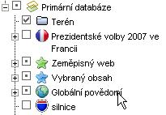

<!--
title : Google Earth konečně česky
author : Roman Ožana <ozana@omdesign.cz>
date : 11.5.2007 18:48:00
tags : google, mapy
-->

# Google Earth konečně česky

Google uvolnil nedávno **českou verzi** skvělého [Google Earth][1]. Přeloženo je:

  * komunikační rozhraní aplikace
  * nápověda (část &#8211; to nejzákladnější)
  * uživatelská příručka

Co k tomu překlad u dodat :-) nejvíce mě pobavil termín **Globální povědomí** &#8211; moc pěkné &#8211; je to jedna z vrstev na boku.

  

 [1]: http://www.google.com/earth/ "Stáhnetě si Google Earth v češtině"