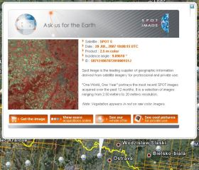

<!--
title : Google Earth přidal SPOT Image
author : Roman Ožana <ozana@omdesign.cz>
date : 17.10.2007 08:39:00
tags : google, mapy
-->

# Google Earth přidal SPOT Image

Do poslední verze [Google Earth][1] byla přidána nová vrstva, která zprostředkovává prodej [SPOT Image][2].

  

Vrstva obsahuje odkazy na přibližně 50 000 snímků pořízených za poslední rok. Pokud kliknete na ikonu reprezentující snímek, jsou Vám zobrazeny **doplňující informace** (viz. obrázek).

Součástí doplňujících informací je odkaz na web, kde je **možné snímek zakoupit** &#8211; pořizování družicových snímků tak nebylo nikdy jednodušší.

Další novinkou je možnost [odeslání vlastního KML][3] souboru pod heslem, ukažte světu svoji práci. Neméně zajímavou novinkou je také [Google Earth Gallery][4].

 [1]: http://www.google.com/earth
 [2]: http://www.spot.com/ "SPOT Image - oficiální stránky"
 [3]: http://earth.google.com/support/bin/request.py?contact_type=kmlsubmit
 [4]: http://www.google.com/gadgets/directory?synd=earth&cat=featured&preview=on