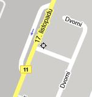

<!--
title : Google mapy kdekoliv a kdykoliv
author : Roman Ožana <ozana@omdesign.cz>
date : 4.2.2007 14:47:01
tags : google, software
-->

# Google mapy kdekoliv a kdykoliv

[][1]Google uvolnil své mobilní mapy pro zařízení s OS Windows Mobile 5.x. Na stránkách [Google Maps Mobile][2] si můžete stáhnout CAB soubor a nainstalovat si jej do svého mobilního zařízení. Snad nemusím připomínat, že aby jste mohli prohlížet mapy, potřebujete mít ono zařízení **připojené k internetu**.

V kombinaci **s GPS přijímačem** si můžete určovat polohu automaticky. Hustota Google Maps je v městech docela slušná i v ČR. Google Mobile Maps si můžete stáhnout také přímo, zadáte-li ve vašem zařízení do prohlížeče adresu <a href="http://www.google.com/gmm"><strong>www.google.com/gmm</strong></a>.

 [1]: vsb-google-mobile.jpg "Google Mobile Maps - Ukázka mapy v mobilu"
 [2]: http://www.google.com/gmm/index.html "Google Mapy v Mobilních zařízeních"