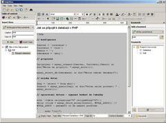

<!--
title : Mám děravou hlavu
author : Roman Ožana <ozana@omdesign.cz>
date : 16.2.2007 09:39:48
tags : software
-->

# Mám děravou hlavu

Mám děravou hlavu, co si nenapíšu to **prostě nevím**. Jsou věci, které jsem **hledal tisíckrát znova a znova**. Třebas jak nastavit nějaká program, jak to či ono udělat v PHP, C# nebo nějakém jiném programovacím jazyku. Moje řešení je následující **vyrobte si vlastní nápovědu**!

Nejschůdnější cestou je použít program [HelpNDoc][1].

  

Co program nabízí:

  * WYSIWYG editor &#8211; vizuální editor podobný co do funkčnosti například wordpad
  * Generování **CHM nápovědy**
  * Generování HTML nápovědy (výborné pro publikaci)
  * Editaci klíčových slov
  * import HTML, RTF, DOC a TXT souborů
  * automaticky vytvoří vyhledávací index
  * zvládá obrázky, symboly, tabulky

Zvládnutí programu [HelpNDoc][1] nezabere **ani 10 minut**. Představte si **kolik času ušetříte** tím, že si některé věci prostě kvalitně poznačíte.

 [1]: http://www.ibe-software.com/products/software/helpndoc/ "HelpNDoc generátor CHM nápovědy"