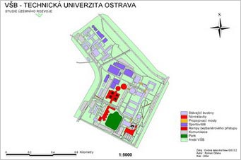

<!--
title : Moje první GIS mapa
author : Roman Ožana <ozana@omdesign.cz>
date : 6.2.2007 09:34:20
tags : GIS, mapy, student
-->

# Moje první GIS mapa

Dneska jsem podnikl malé **archeologické pátrání** po první GIS mapě, kterou jsem kdy udělal. Stalo se tak v rámci předmětu **Úvod do GIS** v roce 2004. Mapka zobrazuje jak jinak než areál VŠB.

  

Nechte se inspirovat a najděte svoje první vizuální mapové dílo :-). Každý �lověk musí někde za�ít, ani gisák není výjimkou.