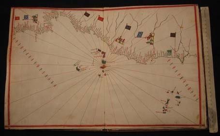

<!--
title : Nalezen 440 let starý námořní atlas
author : Roman Ožana <ozana@omdesign.cz>
date : 21.2.2007 22:11:45
tags : mapy
-->

# Nalezen 440 let starý námořní atlas

Olomoučtí historikové našli prastarý námořní atlas, dnes o tom informoval server [aktualne.cz][1].

Jak už to tak chodí, byl nalezen atlas z roku 1563 náhodou, při stěhování. Však to znáte, kolikrát i doma narazíte na věci, o kterých nemáte ani páru, kde se tam vzali. Co teprve žít ve vědecké knihovně :-).

   foto: <a href="http://aktualne.centrum.cz/domaci/zdravi-skola-spolecnost/foto.phtml?gid=2121&cid=360460&t=&off=0&id=72424#big-img">aktualne.cz</a>

Podivné je zejména to, v jakém výborném stavu se atlas zachoval. Skoro bych **podezříval Olomoucké gisáky**, že v tom mají prsty :-).

Koukal jsme [na to video][2] a nevěřil svým očím, **naprosto úžasné**. Stejně mi pořád není jasné, jak to dokázali tehdá kartografové nakreslit.

V článku se taky píše, že tehdejší kartografy děsilo **prázdné místo na mapě**. Tak si tam prostě nějakou tu bájnou zemi **dokreslili**.

Tenhle přístup se mi dost líbí, taky nemám rád prázdné místo na mapě. Zkusím to někdy aplikovat, je to lepší než tam dát třebas hloupou reklamu.

 [1]: http://aktualne.centrum.cz/domaci/zdravi-skola-spolecnost/clanek.phtml?id=360460 "Unikát. Česko má 440 let starý atlas"
 [2]: http://aktualne.centrum.cz/domaci/zdravi-skola-spolecnost/clanek.phtml?id=360460 "Video je obsaženo v článku aktualne.cz"