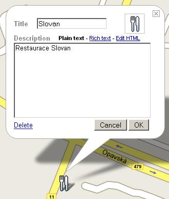
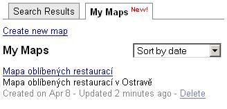

<!--
title : Nechte si vytvořit mapu Googlem
author : Roman Ožana <ozana@omdesign.cz>
date : 8.4.2007 13:00:00
tags : GIS, google, mapy
-->

# Nechte si vytvořit mapu Googlem

Před nedávnem se Google mapy naučily číst KML soubory. Dneska umí [vytvářet][1] uživatelské mapy a to prostřednictvím webového rozhraní.

**Co můžete vytvářet?
  
** Můžete si vytvořit bod, linii, polygon. A to velmi intuitivním způsobem, prostě jen kliknete pravým tlačítkem myši do plochy mapy a zvolíte například Add placemark. Pak na vás vyskočí známá bublinka, kde si prostě nastavíte popis a jméno.

  

**Co je na tom super?
  
** Hlavně to, že už nejste omezení co do podkladu pouze na družicové snímky, které jsou například v ČR dost nepoužitelné.

  

No a na závěr, vše si můžete nechat uložit jako **KML soubor**. Google navíc umožňuje Vámi vytvářené mapy zahrnovat do výsledku vyhledávání. Co více si přát :-) &#8211; snad jen, aby šlo vytvořené mapy nějak slušně sdílet, ne jen prostřednictvím [Link to this page][2].

 [1]: http://maps.google.com/help/maps/userguide/index.html "Map-making: So easy a caveman could do it"
 [2]: http://www.google.com/maps/ms?f=q&hl=cs&layer=&ie=UTF8&om=1&z=17&msid=101852598672093221800.00000111d1440659ccb6f&msa=0 "Odkaz na vytvořenou mapu restaurací"