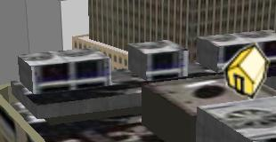
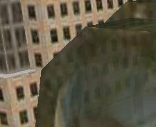

<!--
title : Nové 3D budovy v Google Earth
author : Roman Ožana <ozana@omdesign.cz>
date : 8.1.2007 08:33:13
tags : GIS, google
-->

# Nové 3D budovy v Google Earth

Nedávno Microsoft přinesl pro uživatele Internet Exploreru možnost zobrazovat velmi pěkné a realistické [3D modely budov][1]. Microsoft takto zmapoval několik měst a zpřístupnil je ve své aplikaci [Virtual Earth 3D][2]. Dnes Google odpálil pomyslný míček **zpět na hřiště Microsoftu**.

V další betaverzi [Google Earth][3] přináší novou vrstvu to nejlepší z [3D Warehouse][4]. Tato vrstva **nahrazuje** některé budovy ve staré vrstvě 3D buildings **novými modely**. Modely jsou pokryté texturami a mnohem detailněji zpracované.

  

  Zajímavá je také podpora transparentnosti.

  

  Nových budov sice není moc, ale časem jich doufám bude více a více. Mimo tuto 3D vrstvu přináší Google i některé <a href="http://www.gearthblog.com/blog/archives/2007/01/new_layers_yelp_revi.html">další nové vrstvy</a>.

 [1]: http://en.wikipedia.org/wiki/Windows_Live_Local "Odkaz na ukázku Microsoft Virtual Earth"
 [2]: http://maps.live.com/ "Microsoft Virtual Earth 3D"
 [3]: http://www.google.com/earth
 [4]: http://sketchup.google.com/3dwarehouse "Vyhledávač různých modelů 3D"