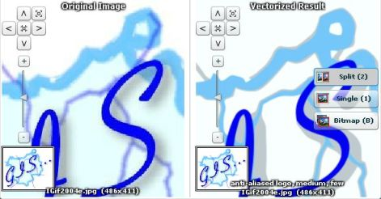

<!--
title : Opravdu kouzeln√Ω VectorMagic
author : Roman Ožana <ozana@omdesign.cz>
date : 23.11.2007 11:26:00
tags : software, weblbinky
-->

# Opravdu kouzeln√Ω VectorMagic

[VectorMagic][1] je online služba, která umožňuje konverzi rastrového obrazu na vektorový. Služba dokáže zpracovat vaše obrázky ve formátu JPG, GIF, PNG, BMP a TIFF. Vektorizace je po zadání několika vstupních parametru prováděna **zcela automaticky** &#8211; výsledek je možné uložit jako PNG, SVG nebo EPS.

  

A jak si tato služba poradila s logem [Institutu Geoinformatiky VŠB][2]? (Bohužel služby už není dostupná zdarma)

 [1]: http://vectormagic.com/home "Str√°nky VectorMagic"
 [2]: http://gis.vsb.cz/