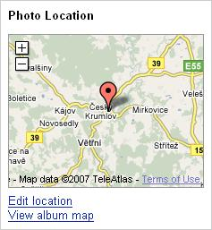

<!--
title : Picaso by se divil
author : Roman Ožana <ozana@omdesign.cz>
date : 27.6.2007 22:10:00
tags : google, GPS, mapy
-->

# Picaso by se divil

[Google Picasa][1] umožňuje od včerejška nově geotagovat obrázky (Photo Location) umístěné ve webové galerii. Podkladem je jak jinak než [Google Maps][2].

  

Dovolil jsem si udělat **malou ukázku** v podobě geotagované vodácko-gisácké [výpravy na Vltavu][3] :-). Celá úprava je navržena logicky a velmi jednoduše &#8211; prostě jen přetáhnete obrázky do plochy mapy. Jediné co by se dalo vytknout je že se chovala **trošku nestandardně** (špatně se překreslovala mapa). Řekl bych, že se to časem zlepší jakmile opadne prvopočáteční zájem o to vyzkoušet novou funkcionalitu Google Picasa.

 [1]: http://picasaweb.google.com/ "Google Picasa"
 [2]: http://maps.google.com/ "Google Maps"
 [3]: http://www.flickr.com/photos/ozzyczech/ "Fotogalerie Vltava"