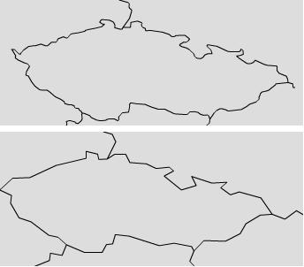

<!--
title : Pro polygony jednodušší
author : Roman Ožana <ozana@omdesign.cz>
date : 18.2.2007 21:08:44
tags : GIS, software
-->

# Pro polygony jednodušší

Jsou chvíle, kdy je **přesnost na škodu**. Prostě někdy máte polygonovou vrstvu, která je fantasticky zpracována. Dalo by se říct, že obsahuje doslova **každý puntík** a každý záhyb. Jenže pro vizualizaci je tohle **naprosto nevhodné**. Jednotlivé polygony je potřeba zjednodušit.

Nemusíte hned utrácet veliké peníze za software, [MapShaper][1] umí zjednodušit polygony zadarmo. Stačí pouze [nahrát svoji vrstvu][2] ve formátu SHP a nastavit parametry zjednodušení a je to. Koukněte se co to provede s ČR.

  

  Výsledek si můžete samozřejmě uložit zpět do SHP. <a href="http://mapshaper.org/">MapShaper</a> je krásný příklad toho, jakým směrem by se měl <strong>GIS vydat</strong>. Je nesmyslné kupovat <a href="http://auto.porsche.cz/" title="Zde si můžete jedno koupit :-)">Porsche</a> (ArcGis), když potřebuji jezdit jen na nákupy. Není lepší si to Porsche na chvilku půjčit?

 [1]: http://mapshaper.org/
 [2]: http://mapshaper.org/test/demo.html "Testovací demo programu MapShaper"