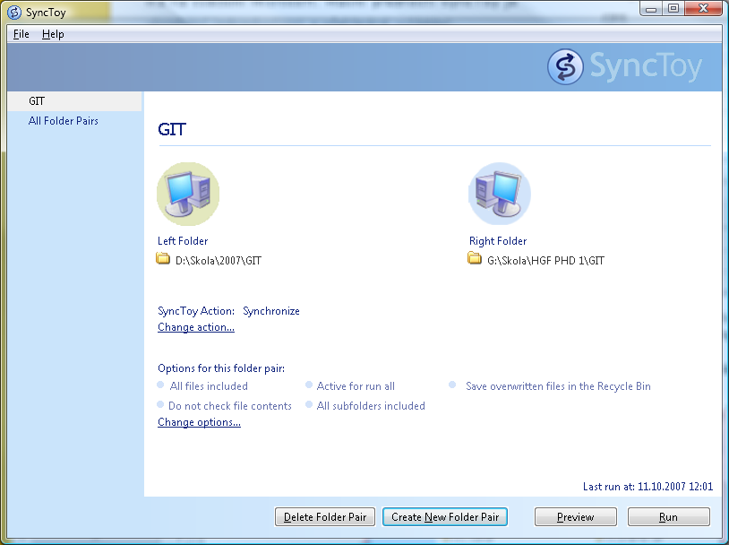

<!--
title : Synchronizace složek hračkou
author : Roman Ožana <ozana@omdesign.cz>
date : 11.10.2007 10:16:00
tags : software
-->

# Synchronizace složek hračkou

Dneska se mi díky free programu [SyncToy 1.4][1] podařila vyřešit synchronizace složek mezi notebookem a přenosným diskem. Díky tomuto programu není třeba uvažovat, které soubory jsem změnil a co je třeba přepsat a co ne.

Program SyncToy je součástí PowerToys balíku, který má na svědomí Microsoft. Hlavní předností SyncToy je absolutní jednoduchost a přehledné ovládání.

  

To, že byl soubor změněn program, zjišťuje na základě porovnání kontrolních součtů (hash). Pokud program detekuje změnu souboru, provede automaticky kopírování, mazání nebo přepsání. Samozřejmostí je možnost synchronizace se složkou uloženou na síťovém disku.

 [1]: http://www.microsoft.com/windowsxp/using/digitalphotography/prophoto/synctoy.mspx "SyncToy - synchronizujeme jednoduše"