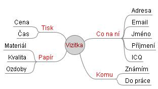

<!--
title : Tvoříme myšlenkové mapy
author : Roman Ožana <ozana@omdesign.cz>
date : 27.6.2007 09:00:00
tags : how-to, software
-->

# Tvoříme myšlenkové mapy

Myšlenková mapa ([mindmap][1]) je diagram, který se používá pro vizualizaci a záznam myšlenek. Ve středu tohoto diagramu je tzv. **klíčové téma**. Od tohoto tématu se postupně navazují další a další klíčové slova.

  

Znalosti jsou prostřednictvím tohoto diagramu reprezentovány jak slovně tak vizuálně (pozice). Myšlenkové mapy je možné použít pro záznam činnosti zvané [brainstorming][2].

V současnosti existuje celá řada nástrojů, které umožňují takové mapy vytvářet. Zde je malý přehled **webových řešení**, jejichž největší výhodou je možnost sdílení map.

  * [MindMeister][3] &#8211; poskytuje veškeré standardní funkce (částečně zdarma)
  * [MindOmo][4] &#8211; poskytuje veškeré standardní funkce (částečně zdarma)
  * [Thinkature][5]{.Thinkature} &#8211; dokáže něco jako myšlenkové mapy nebo spíš poznámkovou tabuli
  * [Mind42][6] &#8211; další nástroj pro tvorbu myšlenkových map
  * [Bubbl.us][7] &#8211; graficky i funkčně velmi povedený kousek (využívá flash)

Poslední software o kterém je žádoucí se zmínit je [FreeMind][8] &#8211; jedná se o dektopové **řešení zdarma**. FreeMind je pohodlný, přehledný a rychlý mindmap editor. Dostupný je jak pro většinu běžně používaných OS.

Doplněno: Posledním objevem je aplikace [Xmind][9], který je zdaleka nejlepší a je postaven nad Platformou Eclipse.

 [1]: http://en.wikipedia.org/wiki/Mindmap "Co je to myšlenková mapa ?"
 [2]: http://en.wikipedia.org/wiki/Brainstorming "Přečti si co je to Brainstorming"
 [3]: http://www.mindmeister.com/ "MindMeister"
 [4]: http://www.mindomo.com/ "MindOmo"
 [5]: http://thinkature.com/
 [6]: http://www.mind42.com/ "Mind42"
 [7]: http://bubbl.us/ "Bubbl.us"
 [8]: http://freemind.sourceforge.net/wiki/ "FreeMind"
 [9]: http://www.xmind.net/ "Xmind"