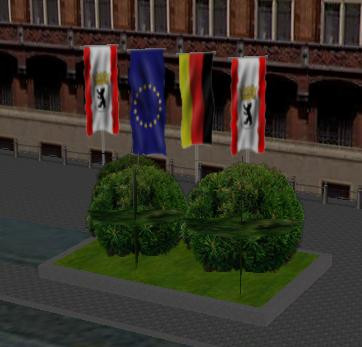
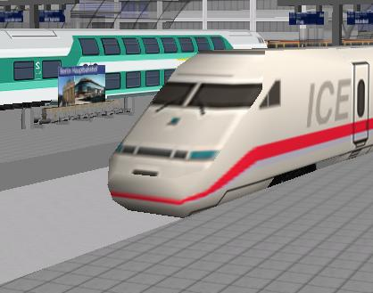

<!--
title : Virtuální Berlín ve 3D
author : Roman Ožana <ozana@omdesign.cz>
date : 9.3.2007 08:50:00
tags : google, mapy
-->

# Virtuální Berlín ve 3D

Německý perfekcionalizmus, stovky modelů, detailní zpracování. Tak by se dal charakterizovat [model města Berlín][1] pro Google Earth. Počáteční zájem o model je velký, [každý se chce podívat][2], což samozřejmě přetěžuje server.

Tak a už stačí namodelovat jen vítr a je to :-).

  

Jak to vypadá na nádraží v Berlíně? Vypadá to, že Vlak ICE se chystá právě odstartovat. Dokonce v hlavní hale postávají skupinky lidí.

  

 [1]: http://www.businesslocationcenter.de/3d/en/A/seite0.jsp?nav1=open
 [2]: http://www.businesslocationcenter.de/3d/div/warning_en.jsp?server=http://node04.3d-stadtmodell.eu/berlin/GE/start_berlin3d.kmz "Podívej se i ty !!!!"