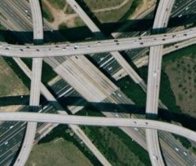

<!--
title : Za hranice řidičáku typu B
author : Roman Ožana <ozana@omdesign.cz>
date : 26.2.2007 23:45:58
tags : GIS, google, mapy
-->

# Za hranice řidičáku typu B

Vytáhnete své omšelé řidičáky, dneska **budeme jezdit**. Napadlo někdy někoho z Vás, kam až je možné zajít **při stavbě silnic**? Pokud někdo považuje za vrchol klasický **dálniční čtyřlístek**. Je na velkém omylu.

Pamatuji si na jednu v Rakousku. Víceúrovňové křížení, tuším minimálně tři patra, nebyl čas to zkoumat, **skutečné maso**. Jenže potom co jsem viděl dnes, vypadá ta **Rakouská úplně směšně**.

Tyhle cestářské šílenosti dostali dokonce svou přezdívku [Malfunction Junction][1] (selživší křížení). Touto přezdívkou se můžou honosit jen skutečně **zběsilé**, nelogické, věc jen komplikující a na hlavu postavené spletence silnic.

Jenže, když se na celou záležitost podíváte **perspektivou ptačí**, chce se říct o **jaká krása**. Prohlédněte si 13 nejlepších křížení pomoci Google Earth (případně přímo [pomocí Google Maps][2])

  

Koukněte taky na [diskuzi na KeyHole][3] &#8211; je jich tam taky několik k vidění.

 [1]: http://en.wikipedia.org/wiki/Malfunction_Junction "Malfunction Junction is a derisive nickname given by motorists to a confusing, dangerous, or otherwise problematic interchange."
 [2]: http://maps.google.com/maps?f=q&hl=en&q=http://www.nabito.net/kml/malfunction_junction.kml&ie=UTF8&om=1&z=6&t=k "Podívejte se na 13 nejlepších křížení pomocí Google Maps"
 [3]: http://bbs.keyhole.com/ubb/showflat.php/Cat/0/Number/7769/page/0/fpart/all/vc/1 "Hromada pěkných křížení je také zde"