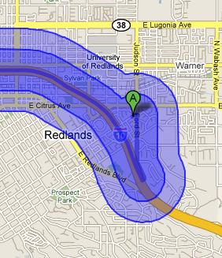

<!--
title : ArcGIS umí publikovat do Google Maps
author : Roman Ožana <ozana@omdesign.cz>
date : 10.7.2008 14:10:09
tags : ESRI, GIS, google, mapy
-->

# ArcGIS umí publikovat do Google Maps

[ArcGIS JavaScript Extension for Google Maps][1] je velmi zajímavé **nové rozšíření** ArcGIS serveru, které umožňuje publikovat prostorové data prostřednictvím Google Maps. S tímto rozšířením můžete:

  * Zobrazovat vlastní mapy nad podklady Google Maps
  * Spouštět GIS modely a výsledky zobrazovat do Google Maps
  * Vyhledávat geoprvky v databázi a výsledky opět publikovat prostřednictvím Google Maps
  * Prohledávat adresní body a výsledky zobrazovat v Google Maps
  * Zobrazovat atributové data nad mapou &#8211; včetně grafů (používá [Google Chart API][2])
  * Dále dokáže zajistit spolupráci s Google Mapplets (malé uživatelské aplikace rozšiřující funkcionalitu Google Maps)

Takhle například **vypadá Buffer** (obálka) připravený v ArcGIS server a zobrazený v Google Maps:

  

 [1]: http://resources.esri.com/help/9.3/arcgisserver/apis/javascript/gmaps/help/google_start.htm "ArcGIS Javascript Extension: dokumentace"
 [2]: http://code.google.com/apis/chart/ "Google Chart API"