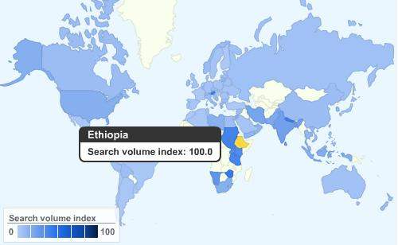

<!--
title : GIS je na ústupu
author : Roman Ožana <ozana@omdesign.cz>
date : 7.8.2008 17:55:00
tags : GIS, google, mapy
-->

# GIS je na ústupu

Ano GIS je **skutečně na ústupu**, alespoň co se do vyhledávání. Od roku 2004 četnost vyhledvánání klesá. [Google Insights for Search][1] je nová služba, která dokáže přehledně zobrazit nejen to, jak moc je dané slovo hledané, ale také to, z jakého státu vyhledávání vzešlo.

Statistiky je možné zobrazovat od roku 2004 do současnosti. Za tuto dobu mají o GIS [největší zájem Etiopané][2].

[caption id="" align="aligncenter" width="464" caption="GIS Search - by Google Insight"][/caption]

Dále můžete zjistit například to, že fraze **GIS** je hledána nejvíce se slovem **data**. Jaké překvapení :-). Na druhém místě se umístilo spojení **GIS map**, no a na třetím místě končilo spojení **GIS a Jobs**.

 [1]: http://www.google.com/insights/search "Google Insights Search"
 [2]: http://www.google.com/insights/search=&q=gis&geo=&date=&clp=&cmpt=q "Klíčové slovo GIS"