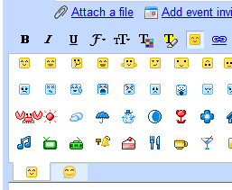

<!--
title : Gmail přidal smajlíky
author : Roman Ožana <ozana@omdesign.cz>
date : 24.10.2008 13:27:14
tags : google
-->

# Gmail přidal smajlíky

Nejlepší email na světě ([Gmail][1]) přidal **další funkci** &#8211; a sice smajlíky. Tuhle funkci najdete editoru nových zpráv, pod rozverně vypadajícím žlutým tlačítkem.

  

Napočítal jsem jich celkem 148, což je opravdu úctyhodné. Můj miranda pack jich má jen 140 :-) &#8211; prostě smajlíkům zdar.

 [1]: http://mail.google.com/ "Gmail"